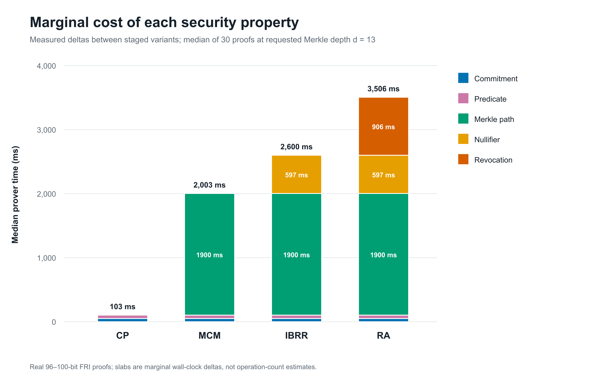
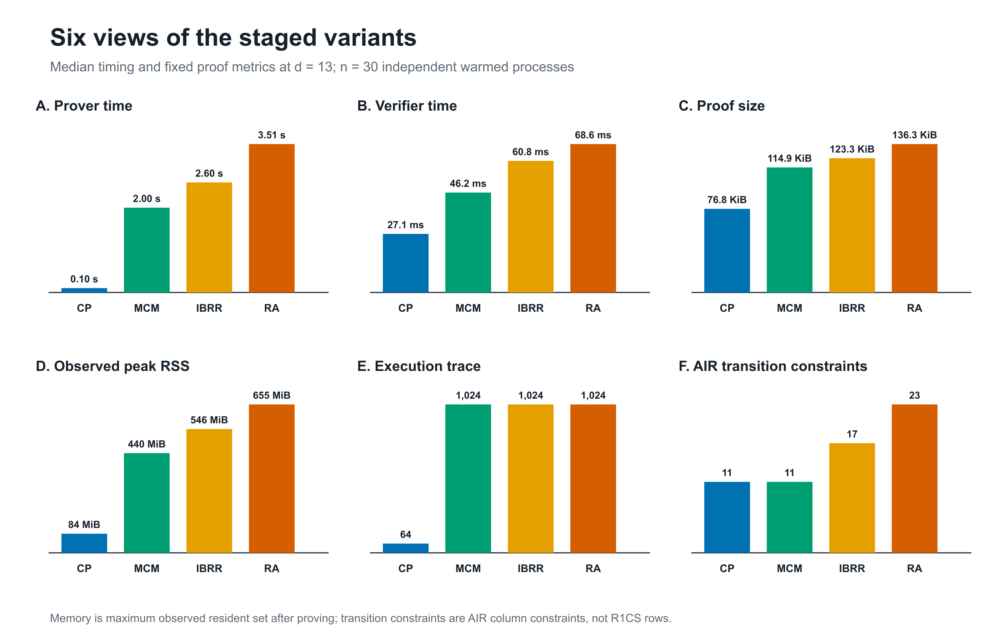
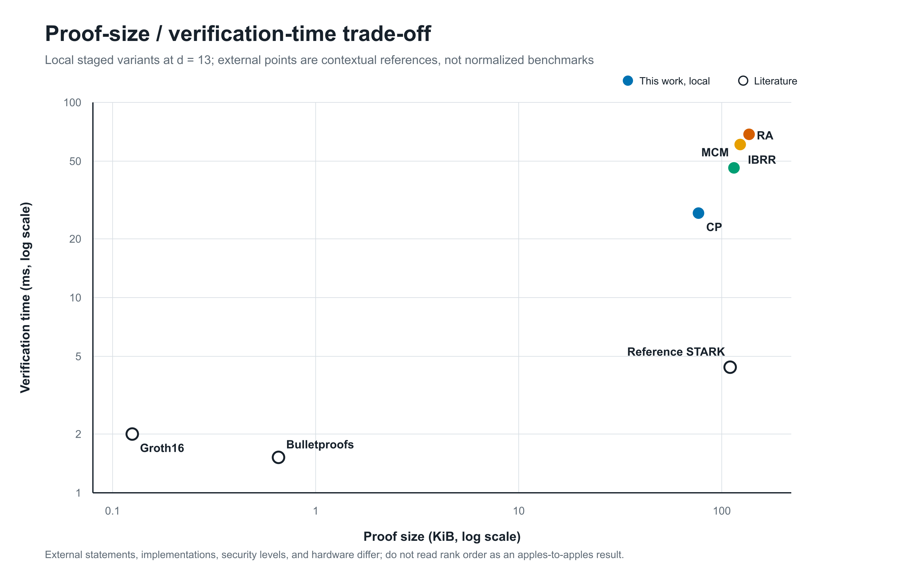

# ZKP Portal — privacy-preserving credential verification

Three parties, one question, one bit of disclosure.

A university issues grade cards. A student holds theirs privately. An employer
asks *"is this person's CGPA at least 8?"* — and learns **only the answer**. Not
the actual CGPA, not the subject marks, not the roll number, not which graduate
this is.

This repository is the artefact for the paper **"A Decentralized Framework for
Privacy-Preserving Credential Verification via Blockchain-Integrated
zk-STARKs"** (Goyal, Pareek, Saxena, Benjamin — BIT Mesra; preprint submitted
to Elsevier). It contains:

- the **issuer / holder / verifier portals** (Next.js + TypeScript, Poseidon
  over BN254 via `poseidon-lite`) that realise the credential lifecycle and
  record a concrete choice for each of the paper's seven implementation
  decisions, and
- the **benchmark harness** ([`benchmarks/`](benchmarks/)) that instantiates the
  paper's four staged zk-STARK algorithms on a real FRI backend and produces
  every number and figure in the paper's evaluation.

---

## Setup

From the repository root:

```bash
npm install
npm run dev
```

Open <http://localhost:3000>. That is the whole setup — no database, no Docker,
no external services, no chain.

| Command | Does |
| --- | --- |
| `npm run reset:chain` | Reset `data/chain.json` to its seed state (do this between rehearsals) |
| `npm run gen:sample` | Regenerate `data/sample-students.csv` |
| `npm run check:e2e` | Headless walk through every acceptance criterion (51 checks) |
| `npm run check:http` | Same, but against a running dev server, with a network-leak audit |
| `npm run check:stark` | Positive and negative tests of the real STARK AIRs |
| `npm run benchmark:stark` | Re-run the paper's benchmark (30 runs per variant, depth sweep, concurrency) |
| `npm run benchmark:figures` | Re-render the figures from `benchmarks/results/` |
| `npm run build` | Production build |

---

## The paper in brief

### Seven decisions the literature leaves open

The paper surveys sixteen research papers and nine deployed systems against
seven decisions that any zero-knowledge credential construction has to make.
None of the sixteen papers states its Merkle padding value, only one specifies
domain separation, and no surveyed work range-constrains a numeric attribute
tightly enough to rule out field wraparound. This codebase records its choice
at each decision:

| # | Decision | Choice made here | Where |
| --- | --- | --- | --- |
| D1 | Merkle padding | `Poseidon(DOM_empty)`, never zero; min depth 5 (20 students → 32 slots) | [`lib/merkle.ts`](lib/merkle.ts) |
| D2 | Domain separation | Distinct tags for identity commitment, nullifier, padding dummy (separated by purpose, not by layer) | [`lib/credential.ts`](lib/credential.ts), [`lib/poseidon.ts`](lib/poseidon.ts) |
| D3 | Nullifier scope | `N = Poseidon(identitySecret, nonce, DOM_null)`, fresh 128-bit nonce per session | [`lib/prover.ts`](lib/prover.ts) |
| D4 | Range constraints | `cgpaInt = 100 × cgpa`, constrained to `0 ≤ cgpaInt < 2^10` before comparing | [`lib/prover.ts`](lib/prover.ts), [`benchmarks/`](benchmarks/) |
| D5 | Revocation enforcement | Accumulator over revoked leaves as a public input (prover-enforced, see [Limitations](#limitations)) | [`lib/prover.ts`](lib/prover.ts) |
| D6 | Commitment binding scope | Six fields bound: identity commitment, CGPA, degree, year, issuer ID, `r`. Name and roll number are display-only and **not** bound | [`lib/credential.ts`](lib/credential.ts) |
| D7 | Implementation and measurement | This repo + [`benchmarks/results/`](benchmarks/results/) | — |

### Four staged algorithms

Each variant adds exactly one security property to the one before it, so the
cost of that property can be measured on its own:

| Variant | Adds | Proves |
| --- | --- | --- |
| **CP-STARK** | baseline | commitment preimage + range-constrained predicate |
| **MCM-STARK** | issuance membership | … and the leaf lies in a published batch (leaf and position private) |
| **IBRR-STARK** | replay binding | … and a nullifier bound to the verifier's session nonce |
| **RA-STARK** | revocation | … and membership in a second, validity tree |

The portal runs one combined proof path that covers all of these checks. The
four variants exist as separate benchmark AIRs in
[`benchmarks/stark-benchmark.cjs`](benchmarks/stark-benchmark.cjs).

---

## Benchmark results

All results are Fiat–Shamir/FRI STARK proofs from `@guildofweavers/genstark`
0.7.6. They were measured on an Intel Core i5-1235U with 16 GB RAM, Windows 10
and Node 22. The medians are over 30 independent warmed processes at requested
Merkle depth *d* = 13. The measured credential is `BTECH/27431/23` (CGPA 8.34,
threshold 8.00).

| Metric | CP | MCM | IBRR | RA |
| --- | ---: | ---: | ---: | ---: |
| Prover time (ms) | 103.2 | 2,003.2 | 2,600.4 | 3,506.1 |
| Verifier time (ms) | 27.1 | 46.2 | 60.8 | 68.6 |
| Proof size (KiB) | 76.8 | 114.9 | 123.3 | 136.3 |
| Post-proof RSS (MiB) | 84 | 440 | 546 | 655 |
| Trace length | 64 | 1,024 | 1,024 | 1,024 |
| AIR transition constraints | 11 | 11 | 17 | 23 |
| genSTARK security estimate (bits) | 100 | 96 | 96 | 96 |

**Marginal cost of each security property.** Private issuance membership
dominates proof generation. Adding the session nullifier costs a further
~0.6 s, and the validity-tree path costs ~0.9 s.



**All six metrics across the staged variants.** Verification stays below 70 ms
for every variant.



**Proof size vs. verification time.** The hollow markers are values reported
by other implementations. They are context only: they are not normalised for
statement, security level, implementation or hardware.



When 280 RA proofs were submitted at once to an 8-worker pool, every proof
verified. End-to-end latency was 2,514 ms at p50, 4,421 ms at p95 and 4,622 ms
at p99, at 60.2 verifications/s.

The remaining figures, covering the proof-time distribution, the depth sweep
and the concurrency CDF, are in [`benchmarks/figures/`](benchmarks/figures/) as
SVG, PNG and PDF. The raw per-run data and run metadata are in
[`benchmarks/results/`](benchmarks/results/). See
[`benchmarks/README.md`](benchmarks/README.md) for the exact protocol and scope.

> **Scope note.** The benchmark backend is genSTARK's 128-bit prime field. It is
> not byte-compatible with the portal's BN254 `poseidon-lite` commitments, and it
> is not wired into the UI. The benchmark backs claims about proof cost only. It
> does not show that the web portal is production-sound.

---

## The three portals

### `/university` — the issuer

The registrar's console.

- **A. Load students** — upload an intake CSV, or click *Load sample data* for
  the 20 seed students. Columns: `name, rollNumber, identityCommitment, cgpa,
  degreeCode, year`. A blank or `auto` commitment is derived from the roll
  number, so a hand-written CSV works too.
- **B. Build the batch** — draws a fresh 256-bit blinding factor `r` per
  student, commits each credential to a leaf, and builds the Merkle tree. Empty
  slots are padded with `Poseidon(dummy)` for a fixed domain-separated dummy —
  never with zero (D1).
- **C. Publish** — POSTs *four fields* to the chain: root, semester ID, leaf
  count, depth. The exact request body is shown on screen before you send it,
  and the API route rejects any other field outright.
- **D. Distribute** — download `credential-{rollNumber}.json` per student, or
  all at once. Each bundle holds the credential fields, `r`, the leaf index and
  the Merkle path. None of it is on chain.
- **E. Revocation** — publishes a leaf hash to the on-chain revocation list.

### `/student` — the holder

The wallet. **The credential lives in React state and nowhere else** — no
localStorage, no server, no API call. Refreshing the page wipes it.

- **A. Import** — drag in a bundle, or use *Load demo student* (which rebuilds
  and publishes the sample batch first, standing in for the university).
- **B. My credential** — your fields, shown to you and only you.
- **C. Verification request** — paste the employer's JSON or pull it from the
  employer tab, then read it in plain English.
- **D. Generate proof** — six steps, each a real computation. On success you get
  the proof plus a **"What the employer will see"** panel. Put those two side by
  side; that contrast is the demo.

### `/employer` — the verifier

- **A. Build a request** — threshold slider (CGPA 0–10, transmitted as
  `cgpa × 100`), degree dropdown, year range, and a fresh 128-bit nonce per
  session.
- **B. Verify a proof** — pick the batch root you accept, paste or pull a proof,
  and get a large **TRUE** or **FALSE** plus a five-item checklist.
- **C. What the employer learned** — the two-column panel. This is the point.

A **Blockchain Explorer** at the bottom of the landing page shows live chain
state throughout.

---

## Scripted 5-minute demo

Reset first: `npm run reset:chain`, then `npm run dev`.

Open three tabs: `/university`, `/student`, `/employer`.

**0:00 — Frame it** (landing page)
> "Three parties. The employer will ask one question and learn one bit."

Point at the Blockchain Explorer: one historical batch, nothing revoked.

**0:30 — Issue the batch** (university tab)

1. Click **Load sample data** → 20 students appear, CGPAs visible in the table.
2. Click **Build Merkle Tree** → read the root aloud; note depth 5, 32 leaf
   slots, 20 real credentials, 12 padding leaves.
3. Semester ID is already `2027-SPRING`. Before clicking, point at the *"Exact
   request body sent to the chain"* block:
   > "Four fields. No name, no CGPA. That is everything the chain ever sees."
4. Click **Publish to Blockchain**.

**1:30 — Hand over a credential** (university tab)

5. In section D, find **Aarav Sharma / BTECH/27431/23 / CGPA 8.34** and click
   **Download Bundle**.
   > "This file is handed over privately. It never touches the chain."

**2:00 — Ask the question** (employer tab)

6. Leave the threshold at **8.0** and the degree at **1101 — B.Tech CSE**.
7. Click **Generate Request**. Point at the nonce:
   > "Fresh per session, so this proof can't be reused anywhere else."
8. Click **Send to student tab**.

**2:45 — Prove it** (student tab)

9. Drag in `credential-BTECH-27431-23.json`. The card shows CGPA **8.34**.
10. Click **Load from employer tab** → the request renders in plain English.
11. Click **Generate Proof**. Read the six steps as they tick through.
12. **Stop here.** Put the proof JSON and the *"What the employer will see"*
    panel side by side.
    > "The card says 8.34. Now find 8.34 in the right-hand panel. It isn't
    > there — the employer gets a threshold of 800, a root, a nonce and a
    > nullifier."
13. Click **Send to employer tab**.

**3:45 — Verify** (employer tab)

14. Click **Load from student tab**, then **Verify** → a large green **TRUE**
    and five green checks.
15. Scroll to **What the employer learned**. Read the two columns aloud. This is
    the payoff.

**4:15 — Show soundness** (student tab)

16. Drag in `credential-BTECH-27155-23.json` (Karan Malhotra, CGPA 6.40). Or
    click the second *Load demo student* button.
17. Click **Load from employer tab**, then **Generate Proof**.
18. The first three steps pass; step 4 fails red:
    *"CGPA constraint failed: the credential does not satisfy cgpaInt >= 800."*
    > "He can't lie. There is no proof of a false statement, so there is nothing
    > to produce."

**4:45 — Revoke** (university tab → employer tab)

19. In section E, click **Revoke** on Aarav's row.
20. Back on the employer tab, click **Verify** again on the same proof →
    **FALSE**, failing at *"Credential not present in revocation list"*.

---

## What is simulated vs. what is real

### Real

All of the following is computed, and any of it can fail:

- **Poseidon hashing** — `poseidon-lite` over the BN254 scalar field, identical
  in Node and browser.
- **Commitments** — `leaf = Poseidon(identityCommitment, cgpaInt, degreeCode,
  year, institutionId, r)` with a genuine 256-bit random `r` per student.
- **The Merkle tree** — built for real, padded with `Poseidon(dummy)`, real
  authentication paths, and `computeRootFromPath` genuinely folds a leaf back to
  the root inside `generateProof`.
- **Every constraint** — identity preimage, leaf reconstruction, Merkle
  inclusion, `cgpaInt >= threshold`, degree match, year range, on-chain root
  lookup, revocation non-membership. Each throws a `ProofConstraintError` naming
  the constraint that failed.
- **The nullifier** — `Poseidon(identitySecret, nonce, NULLIFIER_DOMAIN)`,
  recomputed every time.
- **Verification** — the root is looked up in live chain state, public inputs
  are compared against the request the employer issued, the nonce is checked for
  freshness, and the revocation accumulator is recomputed from the chain.
- **The privacy claim** — no credential field reaches any API route.
  `npm run check:http` records every request body the app sends and asserts that
  none contains a CGPA, name, roll number, blinding factor, identity secret or
  identity commitment.
- **The STARK benchmark** — real FRI proofs for all four staged algorithms
  ([`benchmarks/`](benchmarks/)), kept separate from the UI.

### Simulated

**The portal's proof object.** `pi_a` / `pi_b` / `pi_c` are deterministic
Poseidon-derived field elements shaped like a proof. `verifyProof` checks their
shape, not a low-degree test or pairing equation. The single boundary is marked
at the top of [`lib/prover.ts`](lib/prover.ts).

**The blockchain.** `data/chain.json` behind three API routes, standing in for
contract storage.

**The issuer signature.** `batch.signature` is a deterministic digest, not a
digital signature, and nothing verifies it. A real deployment verifies a
signature over `(root, semesterId, leafCount)` against the public key in
`issuerRegistry` before accepting a root.

**The identity secret's origin.** The university ships a derivable
`identitySecret` inside the bundle so the walkthrough has no registration step.
In the design, the student generates it with `crypto.getRandomValues` at
registration and registers only `Poseidon(identitySecret, IDENTITY_DOMAIN)`; the
university is never in a position to know the secret.

### Limitations

These match Section 8 of the paper:

- **Proving is not cryptographically enforced in the portal.** The constraint
  checks run in the holder's browser, so a holder running *modified* code could
  skip them. The next step is to wire the measured STARK backend, or a
  production equivalent, in place of the two function bodies in
  `lib/prover.ts`.
- **Revocation is prover-enforced.** The verifier checks that the revocation
  accumulator is current, but it cannot itself confirm non-membership because
  the leaf is private. RA-STARK's validity tree is the verifier-checkable
  design; the portal does not implement it yet.
- **The year predicate is not verifier-checked.** The year bounds are not public
  inputs.
- **There is no persistent nullifier set.** Replay is blocked per session by
  matching the nonce, but the same credential can be shown again in a new
  session.
- **This is not a deployed system.** There is no smart contract, no
  decentralised storage and no validator network, and the ledger is simulated.

---

## Design notes worth knowing

**`revocationRoot` is a sixth public input.** It is an accumulator over the
chain's revocation set at proving time. It exists so that the employer can
confirm the proof is current against revocation *without* learning which leaf
the holder owns. Publishing the leaf would single the holder out within the
batch and undo the privacy the rest of the design provides. The holder checks
non-membership and commits to the accumulator; the verifier recomputes it from
live chain state.

The honest consequence: **any** change to the revocation set makes previously
issued proofs stale, not just the revoked holder's. Holders refresh against the
current accumulator. A revoked holder who refreshes fails at `generateProof`; an
unrevoked classmate simply gets a fresh valid proof.

**Anonymity set.** Trees are padded to a minimum depth of 5, so a 20-student
demo cohort still hides in 32 leaf slots. The employer's *"which of the N
graduates"* line reads N from the actual published batch.

**Tree depth.** The step list shows the real depth (5 levels for the sample
batch), not a hard-coded number.

---

## Layout

```
.
├── app/
│   ├── page.tsx                    # landing + Blockchain Explorer
│   ├── university/page.tsx         # reads the sample CSV server-side
│   ├── student/page.tsx
│   ├── employer/page.tsx
│   └── api/chain/{publish,roots,revoke}/route.ts
├── components/                     # portals + shared UI
├── lib/
│   ├── poseidon.ts                 # hash wrapper, domain tags, field arithmetic
│   ├── merkle.ts                   # tree, padding, paths, verification
│   ├── credential.ts               # types, commitments, bundle format, CSV
│   ├── prover.ts                   # STUB BOUNDARY lives here
│   ├── chain.ts                    # chain types + browser client
│   ├── chainStore.ts               # server-only file I/O
│   └── handoff.ts                  # localStorage tab handoff (public data only)
├── benchmarks/
│   ├── stark-benchmark.cjs         # CP / MCM / IBRR / RA AIRs + measurement
│   ├── validate-stark.cjs          # positive and negative STARK tests
│   ├── render-figures.cjs          # results → figures
│   ├── results/                    # raw runs, summaries, metadata
│   └── figures/                    # SVG / PNG / PDF figures used in the paper
├── data/
│   ├── chain.json                  # the simulated ledger
│   ├── chain.seed.json             # reset target
│   └── sample-students.csv         # 20 seed students
└── scripts/                        # data generation + acceptance checks
```

Chain access is split across `lib/chain.ts` and `lib/chainStore.ts` so that `fs`
never reaches the client bundle. The tab handoff lives in its own file so it is
obvious at a glance that only public artefacts go through localStorage.

---

## Sample roster

The 20 students are spread so that both outcomes are one click away:

- **15 at or above CGPA 8.00** — proofs succeed.
- **5 below 8.00** — proof generation fails at the CGPA constraint.
- **Mixed degree codes** (`1101` B.Tech CSE, `1102` B.Tech ECE, `1201` M.Tech
  CSE). These include Nikhil Pillai at CGPA 9.20 in ECE and Shreya Kulkarni at
  8.88 in M.Tech, so the *attribute* constraint can be shown failing for a
  student who clears the threshold comfortably.

| Demo student | Roll | CGPA | Programme | Use for |
| --- | --- | --- | --- | --- |
| Aarav Sharma | `BTECH/27431/23` | 8.34 | B.Tech CSE | the happy path |
| Karan Malhotra | `BTECH/27155/23` | 6.40 | B.Tech CSE | soundness (CGPA fails) |
| Nikhil Pillai | `BTECH/27633/23` | 9.20 | B.Tech ECE | attribute mismatch |

---

## Citation

```
J. Goyal, U. Pareek, S. Saxena, A. Benjamin. "A Decentralized Framework for
Privacy-Preserving Credential Verification via Blockchain-Integrated zk-STARKs."
Preprint submitted to Elsevier, Birla Institute of Technology, Mesra.
```
